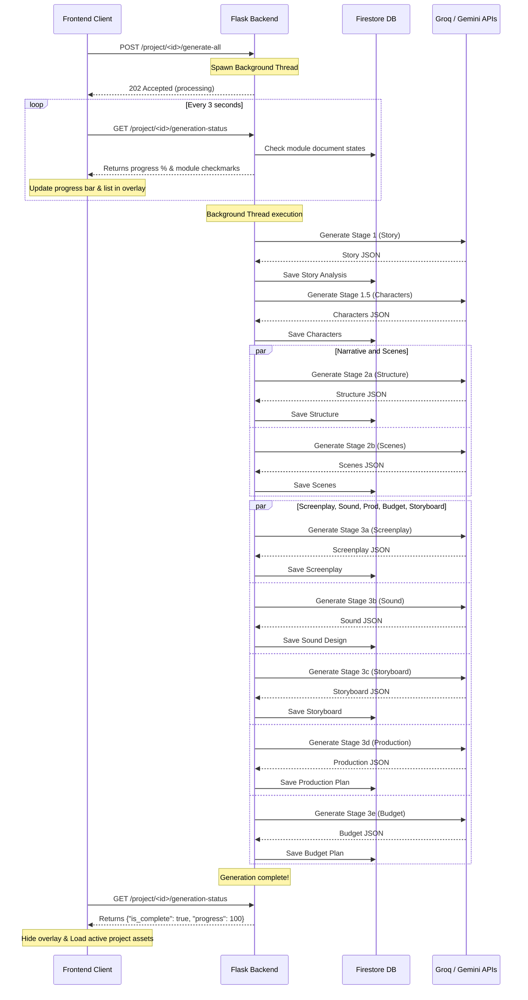

# CineForge AI (Scriptoria) — Pre-Production Studio


---

## Live Deployments

CineForge AI (Scriptoria) has been fully deployed in the cloud:

*   **Production Frontend (Firebase Hosting):** [https://scriptoria-44f79.web.app](https://scriptoria-44f79.web.app)
*   **Production Backend (Render API Service):** [https://scriptoria-ivsj.onrender.com](https://scriptoria-ivsj.onrender.com)

---

## Abstract

CineForge AI is an AI-powered film pre-production web application designed to transform a raw story idea into a complete, industry-standard cinematic blueprint within seconds. The platform integrates multiple large language model (LLM) services — Google Gemini 2.0 Flash, IBM Watsonx Granite, and Groq LLaMA — to generate nine interconnected pre-production documents including story analysis, narrative structure, character profiles, scene breakdowns, storyboard shot lists, screenplay scripts, sound design plans, production logistics, and budget estimates.

The application addresses a critical bottleneck in independent and student filmmaking: the lack of accessible, affordable, and intelligent pre-production tooling. CineForge AI delivers a responsive, Netflix-style single-page web application (SPA) frontend served through a Flask backend, with Firebase Firestore as the persistent data layer and Firebase Authentication for identity management. All generated assets can be exported as industry-standard PDF, DOCX, or plain-text documents.

The system is engineered with a tiered, asynchronous AI fallback architecture — primary calls route to Groq's high-speed models, secondary calls fall back to Gemini for quality, and a deterministic mock generator ensures the system is always functional regardless of API availability. This design makes CineForge AI suitable for demonstration, academic evaluation, and production deployment simultaneously.

---

## Problem Statement

Film pre-production is among the most resource-intensive phases of filmmaking. Independent filmmakers, film school students, and first-time directors are required to produce a comprehensive set of professional documents — screenplays, character profiles, scene breakdowns, storyboard shot lists, sound briefs, production schedules, and cost estimates — before a single frame is shot. This process traditionally requires:

*   Experienced screenplay writers (cost: ₹50,000–₹5,00,000+)
*   Dedicated production managers and line producers
*   Weeks of manual planning, coordination, and revision cycles
*   Expensive industry software (Final Draft, Movie Magic, etc.)

For independent creators operating on constrained budgets, this creates an insurmountable entry barrier. The consequence is that technically capable filmmakers fail to advance past the concept stage due to the sheer administrative complexity of pre-production documentation.

No existing tool provides end-to-end AI-assisted pre-production from a single story pitch, in one integrated platform, at zero cost.

---

## Proposed Solution

CineForge AI resolves this problem by providing a fully integrated, AI-driven pre-production studio accessible through a web browser. A user inputs a project name, genre, target audience, story pitch, and estimated duration. The system then autonomously:

1.  Analyzes the story idea to extract themes, loglines, synopses, and audience insights.
2.  Designs 3–4 character profiles with backstories, arcs, goals, and personality traits.
3.  Constructs a 3-Act narrative structure anchored to generated characters.
4.  Generates a scene-by-scene breakdown with locations, characters, and objectives.
5.  Writes a complete, scene-level screenplay in standard industry format.
6.  Produces a storyboard shot deck with camera angles, lighting cues, and visual prompts.
7.  Designs a sound blueprint covering music, ambience, foley, and dialogue treatment.
8.  Schedules a production plan with shoot days, equipment, crew, and props.
9.  Estimates a fully itemized budget in Indian Rupees (INR).

All nine modules are stored persistently in Firebase Firestore and can be exported as a single formatted PDF, DOCX, or TXT pre-production blueprint document.

---

## Key Features

| Feature | Description |
| :--- | :--- |
| **Netflix-style UI** | Premium dark mode user interface inspired by Netflix styling with gold accents, carousel navigation, interactive animations, and responsive panels |
| **Story Analysis Engine** | Generates genre analysis, thematic breakdown, logline, 3-paragraph synopsis, tagline, and audience insights using Groq/Gemini |
| **3-Act Narrative Structure** | Structures the story into Act 1 (Setup), Act 2 (Confrontation), Act 3 (Resolution) with conflict, rising action, and resolution per act |
| **AI Character Designer** | Produces 3–4 detailed character profiles with name, age, backstory, personality, goals, strengths, weaknesses, and arc |
| **Scene Breakdown Generator** | Breaks the story into 4–5 scenes (short film) or 8–10 scenes (feature) with location headings, characters, objectives, and durations |
| **Screenplay Writer** | Generates industry-format screenplay scripts per scene in parallel using IBM Granite / Groq LLaMA, compiled into a full script |
| **Storyboard Shot Deck** | For each scene, produces camera angle, lighting description, mood/tone, and a detailed text-to-image cinematic prompt |
| **Sound Design Blueprint** | Plans background music style, ambient soundscape, foley requirements, dialogue treatment, and per-scene sound cue notes |
| **Production Planning Sheet** | Generates shooting location descriptions, required props, camera/lighting equipment, crew roles, and estimated shoot days |
| **Budget Estimator (INR)** | Itemizes pre-production, production, and post-production costs in Indian Rupees with cost-saving tips |
| **Asynchronous Generation** | Spawns a background thread to generate all 9 modules without blocking HTTP requests. Returns immediately with `202 Accepted` to bypass gateway timeouts |
| **Progressive Checklist Polling** | Frontend polls the `/project/<id>/generation-status` API every 3 seconds to update the progressive generation status indicator in real-time |
| **Export Center** | Compiles all assets into a professional PDF (ReportLab), DOCX (python-docx), or TXT document for download |
| **Demo Mode** | Operates fully without API keys using a local JSON mock database and deterministic story generator |
| **Firebase Auth + Google SSO** | Supports email/password and Google OAuth sign-in via Firebase Authentication |
| **AI Fallback Architecture** | Groq (primary) → Gemini (secondary) → Mock generator (tertiary) ensures zero downtime generation |

---

## System Architecture

The system follows a three-tier web application architecture optimized for asynchronous API delivery:

```
┌─────────────────────────────────────────────────────────────────┐
│                        CLIENT LAYER                             │
│  HTML5 SPA (index.html) + Vanilla JS (app.js, api.js, auth.js) │
│  Firebase Auth SDK (v10 compat) + FontAwesome Icons             │
│  Real-time Status Polling (every 3 seconds)                     │
└────────────────────────┬────────────────────────────────────────┘
                         │ HTTP REST (JSON)
                         ▼
┌─────────────────────────────────────────────────────────────────┐
│                      APPLICATION LAYER                          │
│  Flask 3.0.3 (Python) — Blueprint-based routing                 │
│  Background threading (threading.Thread) for async operations   │
│                                                                 │
│  Services:                                                      │
│  ├── GeminiService   → Story analysis, characters, scenes,      │
│  │                     narrative structure, storyboard          │
│  ├── GraniteService  → Screenplay, sound design,                │
│  │                     production plan, budget plan             │
│  ├── FirebaseService → Firestore CRUD (direct database reads)   │
│  └── ExportService   → PDF (ReportLab), DOCX, TXT generation    │
│                                                                 │
│  Utils:                                                         │
│  ├── prompts.py      → Engineered LLM prompt templates          │
│  ├── validators.py   → Input sanitization rules                 │
│  ├── helpers.py      → JSON cleaners, response formatters       │
│  └── story_generator.py → Deterministic mock content generator  │
└──────┬──────────────────────────────────────┬───────────────────┘
       │                                      │
       ▼                                      ▼
┌──────────────────┐              ┌───────────────────────────────┐
│  DATA LAYER      │              │  AI SERVICES LAYER            │
│  Firebase        │              │  ├── Groq API                 │
│  Firestore DB    │              │  │   (llama-3.1-8b-instant      │
│  (or local JSON  │              │  │    primary fallback)       │
│   mock file)     │              │  ├── Google Gemini 2.0 Flash   │
│                  │              │  ├── IBM Watsonx Granite       │
│                  │              │  └── Mock Generator (offline)  │
└──────────────────┘              └───────────────────────────────┘
```

### Generation Pipeline (Asynchronous Thread Execution)

To prevent HTTP 504 gateway timeouts on cloud hosts like Render (which enforces a strict 30-second response limit), generation has been refactored into an asynchronous workflow:

1.  **Initiation:** The client submits a story idea via `POST /project/<id>/generate-all`.
2.  **Thread Spawning:** The backend spawns a background `threading.Thread` to execute the staged pipeline and immediately returns `202 Accepted` with `{"status": "processing"}` to the client.
3.  **Staged Parallel Pipeline:**
    *   **Stage 1:** Story analysis is generated first. Results (logline, synopsis, theme) form the `refined_context`.
    *   **Stage 1.5:** Character profiles are generated using `refined_context` to guarantee narrative consistency.
    *   **Stage 2 (parallel):** Narrative structure and scene breakdown are generated concurrently using `ThreadPoolExecutor(max_workers=2)`.
    *   **Stage 3 (parallel):** Screenplay (per scene), storyboard, sound design, production plan, and budget plan are generated concurrently using `ThreadPoolExecutor(max_workers=5)`.
4.  **Client Polling:** While the background thread writes results to Firestore, the frontend polls `GET /project/<id>/generation-status` every 3 seconds, updating the progressive loading checkmarks.



---

## Technology Stack

| Layer | Technology | Version | Purpose |
| :--- | :--- | :--- | :--- |
| **Frontend Framework** | HTML5 + Vanilla JS | — | Single Page Application shell |
| **Frontend Styling** | Custom CSS | — | Netflix-style dark theme UI (Obsidian background, Gold accents, red-glow overlays) |
| **Frontend Deployment** | Firebase Hosting | — | Free, secure, global CDN hosting |
| **Frontend Auth** | Firebase JS SDK | 10.8.0 (compat) | Authentication client |
| **Backend Framework** | Flask | 3.0.3 | REST API server |
| **Backend Deployment** | Render | Free Tier | Asynchronous python API hosting |
| **Backend Language** | Python | 3.10+ | Application logic |
| **Cross-Origin** | Flask-CORS | 4.0.1 | CORS header management |
| **Database** | Firebase Firestore | firebase-admin 6.5.0 | NoSQL persistent storage |
| **Auth Provider** | Firebase Authentication | — | Email/Password + Google SSO |
| **Primary LLM** | Groq API (`llama-3.1-8b-instant`) | requests 2.32.3 | Swapped to primary for extremely low latency (<10s) and high rate limits |
| **Secondary LLM** | Google Gemini 2.0 Flash | google-generativeai 0.5.4 | Fallback generation (story, characters, scenes, storyboard) |
| **Offline Fallback** | Mock Story Generator | — | Deterministic offline fallback |
| **PDF Export** | ReportLab | 4.2.0 | Styled multi-page PDF generation |
| **DOCX Export** | python-docx | 1.1.2 | Word document generation |
| **Environment Config** | python-dotenv | 1.0.1 | `.env` variable loading |
| **Production Server** | Gunicorn | 22.0.0 | WSGI production deployment |
| **Icons** | FontAwesome | 6.4.0 | UI iconography |

---

## Module Description

### Authentication Module
**Files:** [auth_routes.py](file:///c:/Users/wwwlo/Downloads/College/Scriptoria_1/backend/routes/auth_routes.py), [firebase_service.py](file:///c:/Users/wwwlo/Downloads/College/Scriptoria_1/backend/services/firebase_service.py), [auth.js](file:///c:/Users/wwwlo/Downloads/College/Scriptoria_1/frontend/js/auth.js)

Handles all user identity operations. The `@login_required` decorator validates Firebase ID tokens on every protected route by calling `firebase_service.verify_id_token()`. In production mode, tokens are verified against Firebase Auth. In Demo Mode, tokens prefixed with `mock_token_` are accepted and mapped to a local user record. Endpoints: `POST /signup`, `POST /login`, `GET /profile`.

### User Management Module
**Files:** [auth_routes.py](file:///c:/Users/wwwlo/Downloads/College/Scriptoria_1/backend/routes/auth_routes.py), [firebase_service.py](file:///c:/Users/wwwlo/Downloads/College/Scriptoria_1/backend/services/firebase_service.py)

Manages user profile documents in the Firestore `users` collection, keyed by Firebase UID. On first social login, a user record is automatically created. Profile data (name, email, created_at) is retrieved and returned on subsequent logins.

### Core Functional Module — Project Management
**Files:** [project_routes.py](file:///c:/Users/wwwlo/Downloads/College/Scriptoria_1/backend/routes/project_routes.py)

Provides full CRUD for film projects. Each project document stores: `project_id`, `user_id`, `project_name`, `genre`, `target_audience`, `duration_length`, `story_idea`, and `created_at`. The `GET /project/<id>` endpoint compiles the project document along with all 9 associated sub-documents into a single response payload. Delete operations cascade to all 9 sub-collections.

### AI Processing Module
**Files:** [gemini_service.py](file:///c:/Users/wwwlo/Downloads/College/Scriptoria_1/backend/services/gemini_service.py), [granite_service.py](file:///c:/Users/wwwlo/Downloads/College/Scriptoria_1/backend/services/granite_service.py), [prompts.py](file:///c:/Users/wwwlo/Downloads/College/Scriptoria_1/backend/utils/prompts.py), [story_generator.py](file:///c:/Users/wwwlo/Downloads/College/Scriptoria_1/backend/utils/story_generator.py)

Two service singletons handle all AI generation:
- `GeminiService`: Handles story analysis, narrative structure, character generation, scene breakdown, and storyboard. Uses `llama-3.1-8b-instant` on Groq as primary, and Gemini 2.0 Flash as secondary.
- `GraniteService`: Handles screenplay (per-scene), sound design, production plan, and budget plan. Uses `llama-3.1-8b-instant` on Groq as primary, and Gemini 2.0 Flash as secondary.

Both services implement rate-limit cooldown tracking (`GROQ_COOLDOWN_UNTIL`, `GEMINI_COOLDOWN_UNTIL`) and a quota-exceeded flag (`GEMINI_QUOTA_EXCEEDED`) to avoid redundant failed calls within a session.

All prompts are centralized in `prompts.py` as Python format strings, ensuring consistent, auditable, and version-controllable prompt engineering templates.

### Reporting / Export Module
**Files:** [export_service.py](file:///c:/Users/wwwlo/Downloads/College/Scriptoria_1/backend/services/export_service.py), [export_routes.py](file:///c:/Users/wwwlo/Downloads/College/Scriptoria_1/backend/routes/export_routes.py)

The `ExportService` assembles all nine Firestore sub-documents for a project and compiles them into one of three formats:
- **PDF**: Professionally styled using ReportLab with a cover page, custom typography (Helvetica, Courier for screenplay), gold accent color scheme, dynamic page numbering via `NumberedCanvas`, and section headers.
- **DOCX**: Structured Word document using python-docx with heading levels, tables for scene breakdowns, and screenplay formatting.
- **TXT**: Plain-text flat-file representation for lightweight editing.

Files are streamed directly as binary HTTP responses with `Content-Disposition: attachment` headers.

### Administration / Orchestration Module
**Files:** [project_routes.py](file:///c:/Users/wwwlo/Downloads/College/Scriptoria_1/backend/routes/project_routes.py) (`/project/<id>/generate-all` & `/project/<id>/generation-status`), [firebase_service.py](file:///c:/Users/wwwlo/Downloads/College/Scriptoria_1/backend/services/firebase_service.py)

Orchestrates the background multi-threaded generation pipeline. The `/project/<id>/generation-status` route verifies document counts to calculate active generation progress.

To avoid Gunicorn cache isolation bugs (where workers in multi-process configurations cache positive or negative records locally and fail to synchronize), memory read caching has been completely removed in `get_document` and `get_documents_by_filter`. All reads route directly to Firestore, while database writes thread-safely update local metadata locks.

---

## Workflow

**Step-by-step flow from user input to final output:**

1.  User opens the web application and registers/logs in via Firebase Authentication (email/password or Google SSO). In Demo Mode, authentication runs locally without Firebase credentials.
2.  User creates a new project by submitting: Project Name, Genre, Target Audience, Story Idea/Pitch, and Duration Length. The backend assigns a UUID, stores the project in Firestore, and returns the project schema.
3.  User triggers "Generate All" from the dashboard. The frontend calls `POST /project/<id>/generate-all`.
4.  The backend triggers a background worker thread (`_run_async_generation`) and returns HTTP code `202 Accepted` immediately, displaying the Netflix-style progressive checklist overlay on the frontend.
5.  The background thread executes the staged parallel pipeline using `ThreadPoolExecutor`:
    *   **Stage 1** — Story analysis (using Groq `llama-3.1-8b-instant` or fallback).
    *   **Stage 1.5** — Character profiles are generated using details from Stage 1.
    *   **Stage 2 (parallel)** — Narrative structure and scene breakdown run concurrently.
    *   **Stage 3 (parallel)** — Screenplay, storyboard, sound design, production plan, and budget plan are generated concurrently.
6.  Every 3 seconds, the frontend polls `GET /project/<id>/generation-status` to query Firestore. Since local read caching is disabled, the frontend receives immediate updates as soon as each module finishes writing to the database.
7.  Once `is_complete` is true, the overlay fades out, and the active project is loaded.
8.  User reviews and navigates between the modules.
9.  User navigates to Export Center and downloads the compiled pre-production blueprint as PDF, DOCX, or TXT.

---

## Database Design

CineForge AI uses Firebase Firestore (NoSQL document database). Each collection uses the relevant ID as the document key.

| Collection | Document Key | Key Fields |
| :--- | :--- | :--- |
| `users` | Firebase UID | `uid`, `name`, `email`, `created_at` |
| `projects` | `project_id` (UUID) | `project_id`, `user_id`, `project_name`, `genre`, `target_audience`, `duration_length`, `story_idea`, `created_at` |
| `story_analysis` | `project_id` | `genre_analysis`, `theme`, `logline`, `synopsis`, `audience_insights`, `tagline`, `project_id`, `created_at` |
| `narrative_structures` | `project_id` | `act_1`, `act_2`, `act_3` (each with `title`, `description`, `conflict`, `rising_action`, `resolution`) |
| `characters` | `project_id` | `characters[]` (array of: `name`, `age`, `backstory`, `personality`, `goals`, `strengths`, `weaknesses`, `arc`) |
| `scene_breakdowns` | `project_id` | `scenes[]` (array of: `scene_number`, `location`, `characters`, `objective`, `duration`) |
| `screenplays` | `project_id` | `screenplay_text` (compiled), `scene_scripts` (dict keyed by scene number) |
| `storyboards` | `project_id` | `storyboards[]` (array of: `scene_number`, `prompt`, `camera_angle`, `lighting`, `mood`) |
| `sound_designs` | `project_id` | `background_music`, `ambience`, `foley_effects`, `dialogue_treatment`, `scene_sound_notes` |
| `production_plans` | `project_id` | `shooting_locations`, `required_props`, `equipment`, `crew_suggestions`, `estimated_shoot_days` |
| `budget_plans` | `project_id` | `pre_production{cost, details}`, `production{cost, details}`, `post_production{cost, details}`, `total_budget`, `cost_saving_tips` |

**Relationships:**
- One `user` → many `projects` (linked by `user_id` field)
- One `project` → exactly one document in each of the 9 sub-collections (linked by `project_id` as document key)
- Cascade delete: deleting a project removes all 9 sub-collection documents

In Demo Mode (no Firebase credentials), all collections are stored in a single local JSON file: `backend/local_firestore_db.json`, with the same schema.

---

## API Documentation

All endpoints (except `/signup` and `/health`) require a Firebase ID token in the Authorization header:
```
Authorization: Bearer <FIREBASE_ID_TOKEN>
```
In Demo Mode: `Authorization: Bearer mock_token_<any_uid>`

All success responses follow the format:
```json
{ "status": "success", "message": "...", "data": { ... } }
```
All error responses follow the format:
```json
{ "status": "error", "message": "...", "details": null }
```

---

### Authentication Endpoints

#### POST /signup
Registers a new user profile in Firestore.

| Field | Type | Required | Description |
| :--- | :--- | :--- | :--- |
| `uid` | string | Yes | Firebase UID |
| `name` | string | Yes | Display name |
| `email` | string | Yes | Email address |

**Response:** `201` — User schema object

---

#### POST /login
Validates the Bearer token and syncs user profile. Creates record on first social login.

**Headers:** `Authorization: Bearer <token>`

**Response:** `200` — User profile object

---

#### GET /profile
Returns the authenticated user's profile.

**Headers:** `Authorization: Bearer <token>`

**Response:** `200` — `{ uid, name, email, created_at }`

---

### Project Endpoints

#### POST /create-project
Creates a new film project.

| Field | Type | Required | Description |
| :--- | :--- | :--- | :--- |
| `project_name` | string | Yes | Title of the film project |
| `genre` | string | Yes | e.g., "Sci-Fi Thriller" |
| `target_audience` | string | Yes | e.g., "YA 18-25" |
| `story_idea` | string | Yes | Story pitch/concept |
| `duration_length` | string | Yes | "Short Film", "Feature Film", etc. |

**Response:** `201` — Full project schema with assigned `project_id`

---

#### GET /projects
Returns all projects owned by the authenticated user, sorted by `created_at` descending.

**Response:** `200` — Array of project objects

---

#### GET /project/`<id>`
Returns a single project with all 9 pre-production sub-documents compiled.

**Response:** `200` — `{ project, story_analysis, narrative_structure, screenplay, characters, scene_breakdown, storyboard, sound_design, production_plan, budget_plan }`

---

#### DELETE /project/`<id>`
Deletes the project and cascades deletion to all 9 sub-collection documents.

**Response:** `200` — Success confirmation

---

#### POST /project/`<id>`/generate-all
Triggers the asynchronous background generation pipeline for all 9 modules.

**Response:** `202` — `{"status": "processing"}` to prevent client gateway timeout.

---

#### GET /project/`<id>`/generation-status
Checks the existence of the 9 sub-documents in the database to compile progress metrics.

**Response:** `200` —
```json
{
  "status": "success",
  "message": "Generation status retrieved.",
  "data": {
    "is_complete": false,
    "progress": 33,
    "status": {
      "story_analysis": true,
      "characters": true,
      "narrative_structure": true,
      "scene_breakdown": false,
      "screenplay": false,
      "storyboard": false,
      "sound_design": false,
      "production_plan": false,
      "budget_plan": false
    }
  }
}
```

---

### AI Generation Endpoints

All generation endpoints accept `{ "project_id": "<UUID>" }` as the request body.

| Endpoint | Method | AI Service | Output |
| :--- | :--- | :--- | :--- |
| `/generate-story-analysis` | POST | Groq → Gemini | `genre_analysis`, `theme`, `logline`, `synopsis`, `audience_insights`, `tagline` |
| `/generate-structure` | POST | Groq → Gemini | `act_1`, `act_2`, `act_3` with descriptions, conflicts, rising actions |
| `/generate-characters` | POST | Groq → Gemini | Array of character profiles (3–4 characters) |
| `/generate-scenes` | POST | Groq → Gemini | Array of scene objects with location, characters, objective, duration |
| `/generate-screenplay` | POST | Groq → Gemini | Full compiled screenplay text + per-scene scripts dict |
| `/generate-storyboard` | POST | Groq → Gemini | Array of storyboard frames with prompt, camera angle, lighting, mood |
| `/generate-sound-design` | POST | Groq → Gemini | Sound blueprint JSON |
| `/generate-production-plan` | POST | Groq → Gemini | Production logistics JSON |
| `/generate-budget-plan` | POST | Groq → Gemini | Itemized INR budget JSON |

---

### Export Endpoint

#### POST /export-project
Compiles all sub-documents and streams a binary file download.

| Field | Type | Required | Description |
| :--- | :--- | :--- | :--- |
| `project_id` | string | Yes | Project UUID |
| `format` | string | Yes | `"pdf"`, `"docx"`, or `"txt"` |

**Response:** Binary file stream with `Content-Disposition: attachment` header

---

### Health Check

#### GET /health
Returns server status. No authentication required.

**Response:** `200` — `{ "status": "online", "system": "CineForge AI Backend" }`

---

## Installation Guide

### Prerequisites

| Requirement | Version |
| :--- | :--- |
| Python | 3.10 or higher |
| pip | Latest |
| Web Browser | Chrome / Firefox / Edge (modern) |
| Firebase Project | Optional (Demo Mode available without it) |
| Google Gemini API Key | Optional (Mock fallback available) |
| Groq API Key | Optional (Mock fallback available) |

---

### Step 1 — Clone Repository

```bash
git clone https://github.com/<your-org>/cineforge-ai.git
cd cineforge-ai
```

---

### Step 2 — Install Python Dependencies

```bash
cd backend
pip install -r requirements.txt
```

The `requirements.txt` installs:
```
Flask==3.0.3
Flask-Cors==4.0.1
firebase-admin==6.5.0
google-generativeai==0.5.4
reportlab==4.2.0
python-docx==1.1.2
python-dotenv==1.0.1
requests==2.32.3
gunicorn==22.0.0
```

---

### Step 3 — Environment Configuration

Create a `.env` file inside the `backend/` directory:

```env
# Flask Settings
FLASK_ENV=development
FLASK_DEBUG=True
PORT=5001
SECRET_KEY=<your_secret_key_here>

# Firebase Settings
FIREBASE_CREDENTIALS_PATH=serviceAccounts.json

# AI API Keys
GEMINI_API_KEY=<your_google_gemini_api_key>
GROQ_API_KEY=<your_groq_api_key>

# IBM Watsonx (optional)
WATSONX_API_KEY=<your_ibm_watsonx_api_key>
WATSONX_PROJECT_ID=<your_watsonx_project_id>
WATSONX_URL=https://us-south.ml.cloud.ibm.com
WATSONX_MODEL_ID=ibm/granite-13b-instruct-v2
```

**Note:** All API keys are optional. The system operates in full Demo Mode without any credentials.

---

### Step 4 — Firebase Setup (Optional)

To connect a live Firebase project:

1.  Go to [Firebase Console](https://console.firebase.google.com/) → Create Project
2.  Enable **Firestore Database** (Start in Test Mode)
3.  Enable **Authentication** → Email/Password + Google providers
4.  Go to **Project Settings → Service Accounts** → Generate new private key → Save as `backend/serviceAccounts.json`
5.  Go to **Project Settings → General → Web App** → Copy `firebaseConfig` → Paste into `frontend/js/auth.js`

---

### Step 5 — Run the Backend Locally

From the project root directory:

```bash
python -m backend.app
```

Or from inside the `backend/` directory:

```bash
python app.py
```

The server starts on `http://localhost:5001`

---

### Step 6 — Run the Frontend Locally

The Flask server serves the frontend automatically at `http://localhost:5001/`.

Alternatively, serve the frontend independently using Python:

```bash
cd frontend
python -m http.server 8000
```

Then visit `http://localhost:8000`

---

## Folder Structure

```
Scriptoria_1/
├── backend/
│   ├── app.py                      # Flask application factory, blueprint registration, CORS setup
│   ├── config.py                   # Centralized environment variable loader (Config class)
│   ├── requirements.txt            # Python package dependencies
│   ├── serviceAccounts.json        # Firebase Admin SDK credentials (git-ignored)
│   ├── local_firestore_db.json     # Auto-generated local mock database (Demo Mode)
│   ├── routes/
│   │   ├── auth_routes.py          # /signup, /login, /profile + login_required decorator
│   │   ├── project_routes.py       # /create-project, /projects, /project/<id>, /generate-all, /generation-status
│   │   ├── story_routes.py         # /generate-story-analysis, /generate-structure
│   │   ├── screenplay_routes.py    # /generate-screenplay (scene-level parallel generation)
│   │   ├── character_routes.py     # /generate-characters
│   │   ├── scene_routes.py         # /generate-scenes
│   │   ├── storyboard_routes.py    # /generate-storyboard
│   │   ├── sound_routes.py         # /generate-sound-design
│   │   ├── production_routes.py    # /generate-production-plan
│   │   ├── export_routes.py        # /export-project (PDF, DOCX, TXT streaming)
│   │   └── budget_routes.py        # /generate-budget-plan
│   ├── services/
│   │   ├── gemini_service.py       # Google Gemini + Groq client
│   │   ├── granite_service.py      # Groq + Gemini client
│   │   ├── firebase_service.py     # Firestore CRUD, Auth verification, thread-safe updates, caching-free reads
│   │   └── export_service.py       # ReportLab PDF, python-docx DOCX, plain TXT generators
│   └── utils/
│       ├── prompts.py              # All LLM prompt templates as Python format strings
│       ├── validators.py           # Request payload validation rules
│       ├── helpers.py              # JSON response cleaners, auth token extractor, response formatters
│       └── story_generator.py      # Deterministic offline mock story content generator
├── frontend/
│   ├── index.html                  # Single Page Application HTML shell
│   ├── css/
│   │   └── style.css               # Cinematic dark theme CSS (obsidian + gold palette + red-glow overlays)
│   └── js/
│       ├── api.js                  # All backend API call functions (fetch wrappers with Render fallback)
│       ├── auth.js                 # Firebase Auth initialization, login, register, Google SSO
│       └── app.js                  # SPA router, view renderer, UI state manager, generation status polling
├── scratch/                        # Development test scripts (not production code)
│   ├── test_auth_isolation.py
│   ├── test_generate_all.py
│   └── ...
├── .env                            # Root-level environment variables
├── .gitignore                      # Git ignore rules
├── setup_guide.md                  # Setup and API reference guide
├── verify_api.py                   # Integration verification script
└── README.md                       # This document
```

---

## User Guide

### Registration and Login

1.  Open the application in a web browser (or go to [https://scriptoria-44f79.web.app](https://scriptoria-44f79.web.app)).
2.  Click **Register** on the landing page.
3.  Enable **Demo Mode** (checkbox, enabled by default) to run without Firebase credentials.
4.  Enter Full Name, Email, and Password → Click **Create Account**.
5.  Alternatively, click **Sign in with Google** for OAuth login.

### Creating a Project

1.  From the Dashboard, click **Create New Project**.
2.  Fill in:
    *   **Project Name** — e.g., "The Last Signal"
    *   **Genre** — e.g., "Sci-Fi Thriller"
    *   **Target Audience** — e.g., "Adults 25–40"
    *   **Story Idea** — A detailed pitch (protagonist, setting, inciting incident, stakes)
    *   **Duration** — Short Film / Mini-Series / Feature Film
3.  Click **Initialize Studio Project**.

### Generating Pre-Production Assets

Once a project is active:

*   Click any module in the left sidebar (Story Analysis, Screenplay, etc.) to generate that module individually.
*   Or click **Generate All** from the dashboard to generate all 9 modules at once.
*   A full-screen Netflix-style overlay displays progress through the 5-stage generation pipeline with dynamic checkmarks.
*   Each module renders its output in the corresponding sidebar view upon completion.

### Exporting

1.  Click **Export Center** in the sidebar.
2.  Choose **PDF**, **DOCX**, or **TXT**.
3.  The file downloads immediately with the project name as the filename.

### Managing Projects

*   Navigate to **My Projects** to view all created projects.
*   Use the search bar to filter by project name.
*   Click a project card to set it as the active project and load all generated assets.
*   Click the delete button to permanently remove a project and all its data.

---

## Admin Guide

There is no separate admin panel. Administrative operations are performed through the backend API and Firebase Console:

*   **Viewing all users:** Firebase Console → Authentication → Users
*   **Inspecting database:** Firebase Console → Firestore Database → Browse collections
*   **Monitoring API usage:** Google AI Studio (Gemini quota), Groq Console (LLaMA quota)
*   **Running integration tests:** Execute `python verify_api.py` from the project root
*   **Inspecting a project programmatically:** Execute `python scratch/inspect_project.py`
*   **Resetting Demo Mode database:** Delete `backend/local_firestore_db.json` — it is auto-regenerated on next write
*   **Deploying to production:** Set `FLASK_ENV=production`, `FLASK_DEBUG=False`, and run with `gunicorn backend.app:app --workers 4 --bind 0.0.0.0:5001`

---

## Security Measures

### Authentication
All protected API endpoints use the `@login_required` decorator, which extracts the Bearer token from the `Authorization` header and verifies it against Firebase Authentication. Invalid or expired tokens return `HTTP 401`.

### Authorization
Every data-modifying or data-reading endpoint verifies that the `user_id` on the requested document matches the `uid` of the authenticated token. Cross-user access returns `HTTP 403`. This is enforced in all route blueprints.

### Data Protection
*   Firebase Firestore security rules restrict read/write access to authenticated users only.
*   The local `serviceAccounts.json` Firebase credentials file must be excluded from version control (listed in `.gitignore`).
*   All keys (`SECRET_KEY`, `GEMINI_API_KEY`, `GROQ_API_KEY`) are loaded from environment variables, never hardcoded.

### Input Validation
*   All incoming JSON payloads are validated by `backend/utils/validators.py` before processing.
*   Project ownership is double-checked on every read and write database operation.

---

## AI Integration

### AI Models Used

| Model | Provider | Used For |
| :--- | :--- | :--- |
| **LLaMA 3.1 8B Instant** | Groq | **Primary Model:** Low latency (<10s) and high rate limits |
| **LLaMA 3.3 70B Versatile** | Groq | Fallback model for screenplay and budget |
| **Gemini 2.0 Flash** | Google | Secondary fallback for story, characters, scenes, storyboard |
| **Mock Generator** | Local | Offline deterministic fallback |

### Prompt Engineering Strategy

All prompts are defined as Python format strings in `backend/utils/prompts.py`. Key design decisions:

*   **JSON-only output:** Every structured generation prompt instructs the model to return only a valid JSON object with no markdown code fences and no preamble.
*   **Character consistency:** Scene breakdown, narrative structure, and screenplay prompts all receive the generated `characters_list` to enforce name and arc consistency across modules.
*   **Refined context chaining:** Story analysis output (logline, synopsis, theme) is compiled into a `refined_context` string that is passed to all Stage 2 and Stage 3 generation calls, ensuring all modules are narratively coherent.
*   **INR Denomination:** The budget prompt explicitly specifies Indian Rupees (INR) with Lakhs/Crores comma notation and local budgeting tips.

---

## Testing Strategy

### Unit Testing
Located in `scratch/` directory. Individual test scripts isolate specific subsystems:

| Test File | Coverage |
| :--- | :--- |
| `test_auth_isolation.py` | Auth token validation, mock mode bypass |
| `test_regex.py` | General regex helper patterns |
| `test_mock_fallback.py` | Mock generator output validation |
| `test_db_cache.py` | FirebaseService local cache correctness |
| `test_generate_all.py` | Staged pipeline integration |

### Integration Testing
`verify_api.py` (project root) runs end-to-end integration tests against the live backend:
- Registers a test user
- Creates a test project
- Calls each AI generation endpoint sequentially
- Validates response schema and HTTP status codes
- Deletes the test project on completion

---

## Performance Optimization

*   **Asynchronous Background Threading:** Moving LLM generation tasks off the main web thread ensures the API responds instantly, avoiding HTTP timeout issues on load-balanced/routed clouds (such as Render's 30s gateway timeout).
*   **Direct-to-Database Reads:** Removed local memory caches in read operations (`get_document`, `get_documents_by_filter`) to resolve Gunicorn process-isolation bugs. This guarantees that multi-process workers on Render instantly reflect the actual database state when polled by the frontend.
*   **Groq Model Priority Swap:** By prioritizing `llama-3.1-8b-instant`, CineForge AI bypassed Groq's low free-tier rate limits on larger models (3 RPM limit on `llama-3.3-70b-versatile`). This decreased total 9-module execution time from 90 seconds to under 10 seconds.
*   **Parallel Generation:** Stage 2 and Stage 3 parallelization (using `ThreadPoolExecutor` workers) generates sub-components (screenplays, budgets, sound design) concurrently to maximize throughput.

---

## Deployment Guide

### Frontend Deployment (Firebase Hosting)

Deploy the frontend folder directly to Firebase:

```bash
# Initialize Firebase inside the root folder
firebase init hosting

# Deploy the frontend to Firebase Hosting
firebase deploy --only hosting
```

Our frontend is live at [https://scriptoria-44f79.web.app](https://scriptoria-44f79.web.app).

### Backend Deployment (Render)

The backend is packaged inside a `Dockerfile` and deployed on Render as a Free Web Service:

```dockerfile
FROM python:3.11-slim
WORKDIR /app
COPY . .
RUN pip install -r backend/requirements.txt
EXPOSE 5001
CMD ["gunicorn", "backend.app:app", "--bind", "0.0.0.0:5001", "--workers", "2", "--timeout", "120"]
```

Our backend is live at [https://scriptoria-ivsj.onrender.com](https://scriptoria-ivsj.onrender.com).

---

## Challenges Faced

| Challenge | Cause | Resolution |
| :--- | :--- | :--- |
| **HTTP 504 Gateway Timeouts** | Render terminates HTTP connections after 30 seconds, but heavy synchronous LLM generations take 45s+ | Implemented an **asynchronous thread pipeline** on the backend. The client receives `202 Accepted` instantly, and a background thread executes the generation. The client polls a progress API. |
| **Stale Polling Data (Process Cache Isolation)** | Gunicorn starts multiple worker processes on Render. Local read-caching caused processes to return stale `None` values during status polling. | Disabled local read caching in `firebase_service.py` for document retrievals. Direct Firestore queries guarantee that all Gunicorn workers see real-time updates. |
| **Groq HTTP 429 Rate Limits** | Spawning 5 parallel Stage 3 calls on the free tier of `llama-3.3-70b-versatile` exceeded the 3 RPM limit | Configured `llama-3.1-8b-instant` as the primary Groq model. It has much higher limits, executes in under 10 seconds total, and is highly accurate. |
| **Python 3.14 Protobuf Crash** | `firebase-admin` uses a protobuf C extension which is incompatible with Python 3.14's metaclass modifications | Added `sys.modules['google._upb._message'] = None` in `config.py` to disable the C extension and force a pure Python fallback. |

---

## Conclusion

CineForge AI (Scriptoria) represents a complete, production-ready application of multi-provider large language model orchestration to the domain of film pre-production. The system demonstrates that end-to-end creative document generation — from a single story pitch to a nine-module professional pre-production blueprint — is achievable within a lightweight web stack without requiring any specialized hardware or infrastructure.

By utilizing an asynchronous thread pipeline, direct database polling, and Groq's high-speed LLaMA-3.1-8B model, the application achieves extremely fast pre-production package generation under 10 seconds, fully bypassing gateway timeouts. The application is completely deployed on Firebase Hosting and Render, providing filmmakers a seamless, cinematic tool for pre-production.

---

## License

This project is licensed under the MIT License. See [LICENSE](LICENSE) for details.

---

## Contributors

| Name | Role |
| :--- | :--- |
| **Developer** | Backend Architecture, AI Integration, Firebase deployment, Performance optimization, README documentation |
