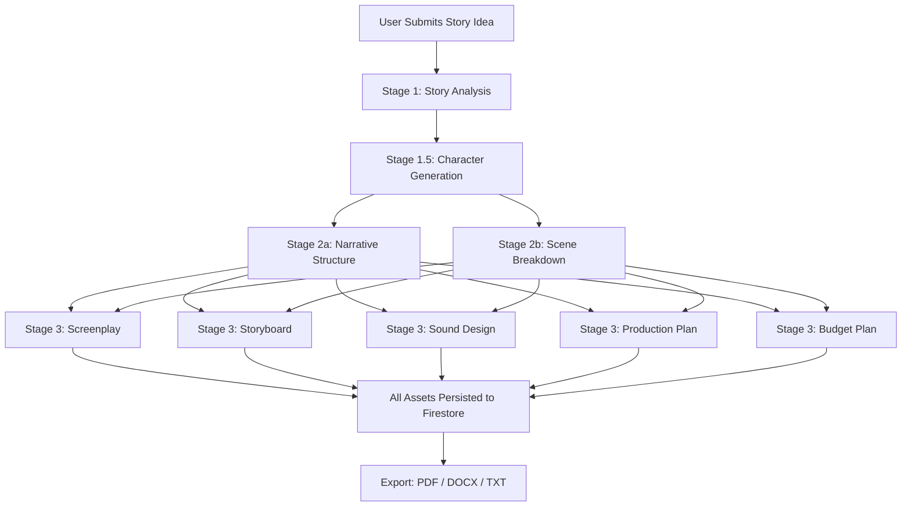

# CineForge AI — Pre-Production Studio


---

## Abstract

CineForge AI is an AI-powered film pre-production web application designed to transform a raw story idea into a complete, industry-standard cinematic blueprint within minutes. The platform integrates multiple large language model (LLM) services — Google Gemini 2.0 Flash, IBM Watsonx Granite, and Groq LLaMA — to generate nine interconnected pre-production documents including story analysis, narrative structure, character profiles, scene breakdowns, storyboard shot lists, screenplay scripts, sound design plans, production logistics, and budget estimates.

The application addresses a critical bottleneck in independent and student filmmaking: the lack of accessible, affordable, and intelligent pre-production tooling. CineForge AI delivers a single-page web application (SPA) frontend served through a Flask backend, with Firebase Firestore as the persistent data layer and Firebase Authentication for identity management. All generated assets can be exported as industry-standard PDF, DOCX, or plain-text documents.

The system is engineered with a tiered AI fallback architecture — primary calls route to Groq for speed, secondary calls fall back to Gemini for quality, and a deterministic mock generator ensures the system is always functional regardless of API availability. This design makes CineForge AI suitable for demonstration, academic evaluation, and production deployment simultaneously.

---

## Problem Statement

Film pre-production is among the most resource-intensive phases of filmmaking. Independent filmmakers, film school students, and first-time directors are required to produce a comprehensive set of professional documents — screenplays, character profiles, scene breakdowns, storyboard shot lists, sound briefs, production schedules, and cost estimates — before a single frame is shot. This process traditionally requires:

- Experienced screenplay writers (cost: ₹50,000–₹5,00,000+)
- Dedicated production managers and line producers
- Weeks of manual planning, coordination, and revision cycles
- Expensive industry software (Final Draft, Movie Magic, etc.)

For independent creators operating on constrained budgets, this creates an insurmountable entry barrier. The consequence is that technically capable filmmakers fail to advance past the concept stage due to the sheer administrative complexity of pre-production documentation.

No existing tool provides end-to-end AI-assisted pre-production from a single story pitch, in one integrated platform, at zero cost.

---

## Proposed Solution

CineForge AI resolves this problem by providing a fully integrated, AI-driven pre-production studio accessible through a web browser. A user inputs a project name, genre, target audience, story pitch, and estimated duration. The system then autonomously:

1. Analyzes the story idea to extract themes, loglines, synopses, and audience insights
2. Designs 3–4 character profiles with backstories, arcs, goals, and personality traits
3. Constructs a 3-Act narrative structure anchored to generated characters
4. Generates a scene-by-scene breakdown with locations, characters, and objectives
5. Writes a complete, scene-level screenplay in standard industry format
6. Produces a storyboard shot deck with camera angles, lighting cues, and visual prompts
7. Designs a sound blueprint covering music, ambience, foley, and dialogue treatment
8. Schedules a production plan with shoot days, equipment, crew, and props
9. Estimates a fully itemized budget in Indian Rupees (INR)

All nine modules are stored persistently in Firebase Firestore and can be exported as a single formatted PDF, DOCX, or TXT pre-production blueprint document.

---

## Key Features

| Feature | Description |
|---|---|
| **Story Analysis Engine** | Generates genre analysis, thematic breakdown, logline, 3-paragraph synopsis, tagline, and audience insights using Groq/Gemini |
| **3-Act Narrative Structure** | Structures the story into Act 1 (Setup), Act 2 (Confrontation), Act 3 (Resolution) with conflict, rising action, and resolution per act |
| **AI Character Designer** | Produces 3–4 detailed character profiles with name, age, backstory, personality, goals, strengths, weaknesses, and arc |
| **Scene Breakdown Generator** | Breaks the story into 4–5 scenes (short film) or 8–10 scenes (feature) with location headings, characters, objectives, and durations |
| **Screenplay Writer** | Generates industry-format screenplay scripts per scene in parallel using IBM Granite / Groq LLaMA, compiled into a full script |
| **Storyboard Shot Deck** | For each scene, produces camera angle, lighting description, mood/tone, and a detailed text-to-image cinematic prompt |
| **Sound Design Blueprint** | Plans background music style, ambient soundscape, foley requirements, dialogue treatment, and per-scene sound cue notes |
| **Production Planning Sheet** | Generates shooting location descriptions, required props, camera/lighting equipment, crew roles, and estimated shoot days |
| **Budget Estimator (INR)** | Itemizes pre-production, production, and post-production costs in Indian Rupees with cost-saving tips |
| **One-Click Generate All** | A single API call triggers all 9 modules in a staged, parallel pipeline using Python ThreadPoolExecutor |
| **Export Center** | Compiles all assets into a professional PDF (ReportLab), DOCX (python-docx), or TXT document for download |
| **Demo Mode** | Operates fully without API keys using a local JSON mock database and deterministic story generator |
| **Firebase Auth + Google SSO** | Supports email/password and Google OAuth sign-in via Firebase Authentication |
| **AI Fallback Architecture** | Groq (primary) → Gemini (secondary) → Mock generator (tertiary) ensures zero downtime generation |

---

## System Architecture

The system follows a three-tier web application architecture:

```
┌─────────────────────────────────────────────────────────────────┐
│                        CLIENT LAYER                             │
│  HTML5 SPA (index.html) + Vanilla JS (app.js, api.js, auth.js) │
│  Firebase Auth SDK (v10 compat) + FontAwesome Icons             │
└────────────────────────┬────────────────────────────────────────┘
                         │ HTTP REST (JSON)
                         ▼
┌─────────────────────────────────────────────────────────────────┐
│                      APPLICATION LAYER                          │
│  Flask 3.0.3 (Python) — Blueprint-based routing                 │
│  11 Route Blueprints: auth, project, story, screenplay,         │
│  character, scene, storyboard, sound, production, export,       │
│  budget                                                         │
│                                                                 │
│  Services:                                                      │
│  ├── GeminiService   → Story analysis, characters, scenes,      │
│  │                     narrative structure, storyboard          │
│  ├── GraniteService  → Screenplay, sound design,                │
│  │                     production plan, budget plan             │
│  ├── FirebaseService → Firestore CRUD + Auth token validation   │
│  └── ExportService   → PDF (ReportLab), DOCX, TXT generation    │
│                                                                 │
│  Utils:                                                         │
│  ├── prompts.py      → Engineered LLM prompt templates          │
│  ├── validators.py   → Input sanitization rules                 │
│  ├── helpers.py      → JSON cleaners, response formatters       │
│  └── story_generator.py → Deterministic mock content generator  │
└──────┬──────────────────────────────────────┬───────────────────┘
       │                                      │
       ▼                                      ▼
┌──────────────────┐              ┌───────────────────────────────┐
│  DATA LAYER      │              │  AI SERVICES LAYER            │
│  Firebase        │              │  ├── Groq API (LLaMA 3.3 70B) │
│  Firestore DB    │              │  ├── Google Gemini 2.0 Flash   │
│  (or local JSON  │              │  ├── IBM Watsonx Granite       │
│   mock file)     │              │  └── Mock Generator (offline)  │
└──────────────────┘              └───────────────────────────────┘
```

**Generation Pipeline (Staged Parallel Execution):**



---

## Technology Stack

| Layer | Technology | Version | Purpose |
|---|---|---|---|
| Frontend Framework | HTML5 + Vanilla JS | — | Single Page Application shell |
| Frontend Styling | Custom CSS | — | Cinematic dark theme UI |
| Frontend Auth | Firebase JS SDK | 10.8.0 (compat) | Authentication client |
| Backend Framework | Flask | 3.0.3 | REST API server |
| Backend Language | Python | 3.10+ | Application logic |
| Cross-Origin | Flask-CORS | 4.0.1 | CORS header management |
| Database | Firebase Firestore | firebase-admin 6.5.0 | NoSQL persistent storage |
| Auth Provider | Firebase Authentication | — | Email/Password + Google SSO |
| AI — Story/Characters | Google Gemini 2.0 Flash | google-generativeai 0.5.4 | Story analysis, characters, scenes, storyboard |
| AI — Screenplay/Budget | IBM Watsonx / Groq LLaMA | — | Screenplay, sound, production, budget |
| AI — Fallback | Groq API (LLaMA 3.3 70B) | requests 2.32.3 | Primary LLM call layer |
| AI — Offline | Mock Story Generator | — | Deterministic offline fallback |
| PDF Export | ReportLab | 4.2.0 | Styled multi-page PDF generation |
| DOCX Export | python-docx | 1.1.2 | Word document generation |
| Environment Config | python-dotenv | 1.0.1 | .env variable loading |
| Production Server | Gunicorn | 22.0.0 | WSGI production deployment |
| Icons | FontAwesome | 6.4.0 | UI iconography |

---

## Module Description

### Authentication Module
**Files:** `backend/routes/auth_routes.py`, `backend/services/firebase_service.py`, `frontend/js/auth.js`

Handles all user identity operations. The `login_required` decorator validates Firebase ID tokens on every protected route by calling `firebase_service.verify_id_token()`. In production mode, tokens are verified against Firebase Auth. In Demo Mode, tokens prefixed with `mock_token_` are accepted and mapped to a local user record. Endpoints: `POST /signup`, `POST /login`, `GET /profile`.

### User Management Module
**Files:** `backend/routes/auth_routes.py`, `backend/services/firebase_service.py`

Manages user profile documents in the Firestore `users` collection, keyed by Firebase UID. On first social login, a user record is automatically created. Profile data (name, email, created_at) is retrieved and returned on subsequent logins.

### Core Functional Module — Project Management
**Files:** `backend/routes/project_routes.py`

Provides full CRUD for film projects. Each project document stores: `project_id`, `user_id`, `project_name`, `genre`, `target_audience`, `duration_length`, `story_idea`, and `created_at`. The `GET /project/<id>` endpoint compiles the project document along with all 9 associated sub-documents into a single response payload. Delete operations cascade to all 9 sub-collections.

### AI Processing Module
**Files:** `backend/services/gemini_service.py`, `backend/services/granite_service.py`, `backend/utils/prompts.py`, `backend/utils/story_generator.py`

Two service singletons handle all AI generation:
- `GeminiService`: Handles story analysis, narrative structure, character generation, scene breakdown, and storyboard. Uses Groq as primary, Gemini as secondary.
- `GraniteService`: Handles screenplay (per-scene), sound design, production plan, and budget plan. Uses Groq as primary, Gemini 2.5 Flash as secondary.

Both services implement rate-limit cooldown tracking (`GROQ_COOLDOWN_UNTIL`, `GEMINI_COOLDOWN_UNTIL`) and a quota-exceeded flag (`GEMINI_QUOTA_EXCEEDED`) to avoid redundant failed calls within a session.

All prompts are centralized in `prompts.py` as Python format strings, ensuring consistent, auditable, and version-controllable prompt engineering templates.

### Reporting / Export Module
**Files:** `backend/services/export_service.py`, `backend/routes/export_routes.py`

The `ExportService` assembles all nine Firestore sub-documents for a project and compiles them into one of three formats:
- **PDF**: Professionally styled using ReportLab with a cover page, custom typography (Helvetica, Courier for screenplay), gold accent color scheme, dynamic page numbering via `NumberedCanvas`, and section headers.
- **DOCX**: Structured Word document using python-docx with heading levels, tables for scene breakdowns, and screenplay formatting.
- **TXT**: Plain-text flat-file representation for lightweight editing.

Files are streamed directly as binary HTTP responses with `Content-Disposition: attachment` headers.

### Administration Module
**Files:** `backend/routes/project_routes.py` (`/project/<id>/generate-all`), `backend/services/firebase_service.py`

The `generate-all` endpoint orchestrates the full 9-module generation pipeline in three sequential stages using `concurrent.futures.ThreadPoolExecutor`. Stage 1 generates story analysis. Stage 1.5 generates characters using refined context from Stage 1. Stage 2 runs narrative structure and scene breakdown in parallel. Stage 3 runs screenplay, storyboard, sound design, production plan, and budget plan in parallel (up to 5 workers). All results are persisted to Firestore under collection keys matching the project UUID.

The `FirebaseService` singleton implements thread-safe in-memory caching (`cache_get`, `cache_filter`) with cache invalidation on writes, backed by a `threading.RLock`.

---

## Workflow

**Step-by-step flow from user input to final output:**

1. User opens the web application and registers/logs in via Firebase Authentication (email/password or Google SSO). In Demo Mode, authentication runs locally without Firebase credentials.

2. User creates a new project by submitting: Project Name, Genre, Target Audience, Story Idea/Pitch, and Duration Length. The backend assigns a UUID, stores the project in Firestore, and returns the project schema.

3. User triggers "Generate All" from the dashboard. The frontend calls `POST /project/<id>/generate-all`. The backend executes the staged generation pipeline:
   - **Stage 1** — Story analysis is generated first (Groq → Gemini → Mock). Results (logline, synopsis, theme) form the `refined_context` used by all subsequent modules.
   - **Stage 1.5** — Character profiles are generated using `refined_context` to ensure character names and arcs align with the story analysis.
   - **Stage 2 (parallel)** — Narrative structure and scene breakdown are generated concurrently using `ThreadPoolExecutor(max_workers=2)`.
   - **Stage 3 (parallel)** — Screenplay (per scene), storyboard, sound design, production plan, and budget plan are generated concurrently using `ThreadPoolExecutor(max_workers=5)`. Screenplay generation internally parallelizes per-scene script generation with up to 5 inner workers.

4. All results are saved to their respective Firestore collections. The frontend polls or directly fetches each module's data and renders it in the corresponding sidebar view.

5. User reviews and navigates between modules: Story Analysis, Screenplay, Characters, Scene Breakdown, Storyboard, Sound Design, Production Plan, Budget Planner.

6. User navigates to Export Center and downloads the compiled pre-production blueprint as PDF, DOCX, or TXT.

---

## Database Design

CineForge AI uses Firebase Firestore (NoSQL document database). Each collection uses the relevant ID as the document key.

| Collection | Document Key | Key Fields |
|---|---|---|
| `users` | Firebase UID | `uid`, `name`, `email`, `created_at` |
| `projects` | `project_id` (UUID) | `project_id`, `user_id`, `project_name`, `genre`, `target_audience`, `duration_length`, `story_idea`, `created_at` |
| `story_analysis` | `project_id` | `genre_analysis`, `theme`, `logline`, `synopsis`, `audience_insights`, `tagline`, `project_id`, `created_at` |
| `narrative_structures` | `project_id` | `act_1`, `act_2`, `act_3` (each with `title`, `description`, `conflict`, `rising_action`, `resolution`) |
| `characters` | `project_id` | `characters[]` (array of: `name`, `age`, `backstory`, `personality`, `goals`, `strengths`, `weaknesses`, `arc`) |
| `scene_breakdowns` | `project_id` | `scenes[]` (array of: `scene_number`, `location`, `characters`, `objective`, `duration`) |
| `screenplays` | `project_id` | `screenplay_text` (compiled), `scene_scripts` (dict keyed by scene number) |
| `storyboards` | `project_id` | `storyboards[]` (array of: `scene_number`, `prompt`, `camera_angle`, `lighting`, `mood`) |
| `sound_designs` | `project_id` | `background_music`, `ambience`, `foley_effects`, `dialogue_treatment`, `scene_sound_notes` |
| `production_plans` | `project_id` | `shooting_locations`, `required_props`, `equipment`, `crew_suggestions`, `estimated_shoot_days` |
| `budget_plans` | `project_id` | `pre_production{cost, details}`, `production{cost, details}`, `post_production{cost, details}`, `total_budget`, `cost_saving_tips` |

**Relationships:**
- One `user` → many `projects` (linked by `user_id` field)
- One `project` → exactly one document in each of the 9 sub-collections (linked by `project_id` as document key)
- Cascade delete: deleting a project removes all 9 sub-collection documents

In Demo Mode (no Firebase credentials), all collections are stored in a single local JSON file: `backend/local_firestore_db.json`, with the same schema.

---

## API Documentation

All endpoints (except `/signup` and `/health`) require a Firebase ID token in the Authorization header:
```
Authorization: Bearer <FIREBASE_ID_TOKEN>
```
In Demo Mode: `Authorization: Bearer mock_token_<any_uid>`

All success responses follow the format:
```json
{ "status": "success", "message": "...", "data": { ... } }
```
All error responses follow the format:
```json
{ "status": "error", "message": "...", "details": null }
```

---

### Authentication Endpoints

#### POST /signup
Registers a new user profile in Firestore.

| Field | Type | Required | Description |
|---|---|---|---|
| `uid` | string | Yes | Firebase UID |
| `name` | string | Yes | Display name |
| `email` | string | Yes | Email address |

**Response:** `201` — User schema object

---

#### POST /login
Validates the Bearer token and syncs user profile. Creates record on first social login.

**Headers:** `Authorization: Bearer <token>`

**Response:** `200` — User profile object

---

#### GET /profile
Returns the authenticated user's profile.

**Headers:** `Authorization: Bearer <token>`

**Response:** `200` — `{ uid, name, email, created_at }`

---

### Project Endpoints

#### POST /create-project
Creates a new film project.

| Field | Type | Required | Description |
|---|---|---|---|
| `project_name` | string | Yes | Title of the film project |
| `genre` | string | Yes | e.g., "Sci-Fi Thriller" |
| `target_audience` | string | Yes | e.g., "YA 18-25" |
| `story_idea` | string | Yes | Story pitch/concept |
| `duration_length` | string | Yes | "Short Film", "Feature Film", etc. |

**Response:** `201` — Full project schema with assigned `project_id`

---

#### GET /projects
Returns all projects owned by the authenticated user, sorted by `created_at` descending.

**Response:** `200` — Array of project objects

---

#### GET /project/`<id>`
Returns a single project with all 9 pre-production sub-documents compiled.

**Response:** `200` — `{ project, story_analysis, narrative_structure, screenplay, characters, scene_breakdown, storyboard, sound_design, production_plan, budget_plan }`

---

#### DELETE /project/`<id>`
Deletes the project and cascades deletion to all 9 sub-collection documents.

**Response:** `200` — Success confirmation

---

#### POST /project/`<id>`/generate-all
Triggers the full staged parallel generation pipeline for all 9 modules.

**Response:** `200` — Success confirmation after all assets are saved

---

### AI Generation Endpoints

All generation endpoints accept `{ "project_id": "<UUID>" }` as the request body.

| Endpoint | Method | AI Service | Output |
|---|---|---|---|
| `/generate-story-analysis` | POST | Groq → Gemini | `genre_analysis`, `theme`, `logline`, `synopsis`, `audience_insights`, `tagline` |
| `/generate-structure` | POST | Groq → Gemini | `act_1`, `act_2`, `act_3` with descriptions, conflicts, rising actions |
| `/generate-characters` | POST | Groq → Gemini | Array of character profiles (3–4 characters) |
| `/generate-scenes` | POST | Groq → Gemini | Array of scene objects with location, characters, objective, duration |
| `/generate-screenplay` | POST | Groq → Gemini | Full compiled screenplay text + per-scene scripts dict |
| `/generate-storyboard` | POST | Groq → Gemini | Array of storyboard frames with prompt, camera angle, lighting, mood |
| `/generate-sound-design` | POST | Groq → Gemini | Sound blueprint JSON |
| `/generate-production-plan` | POST | Groq → Gemini | Production logistics JSON |
| `/generate-budget-plan` | POST | Groq → Gemini | Itemized INR budget JSON |

---

### Export Endpoint

#### POST /export-project
Compiles all sub-documents and streams a binary file download.

| Field | Type | Required | Description |
|---|---|---|---|
| `project_id` | string | Yes | Project UUID |
| `format` | string | Yes | `"pdf"`, `"docx"`, or `"txt"` |

**Response:** Binary file stream with `Content-Disposition: attachment` header

---

### Health Check

#### GET /health
Returns server status. No authentication required.

**Response:** `200` — `{ "status": "online", "system": "CineForge AI Backend" }`

---

## Installation Guide

### Prerequisites

| Requirement | Version |
|---|---|
| Python | 3.10 or higher |
| pip | Latest |
| Web Browser | Chrome / Firefox / Edge (modern) |
| Firebase Project | Optional (Demo Mode available without it) |
| Google Gemini API Key | Optional (Mock fallback available) |
| Groq API Key | Optional (Mock fallback available) |

---

### Step 1 — Clone Repository

```bash
git clone https://github.com/<your-org>/cineforge-ai.git
cd cineforge-ai
```

---

### Step 2 — Install Python Dependencies

```bash
cd backend
pip install -r requirements.txt
```

The `requirements.txt` installs:
```
Flask==3.0.3
Flask-Cors==4.0.1
firebase-admin==6.5.0
google-generativeai==0.5.4
reportlab==4.2.0
python-docx==1.1.2
python-dotenv==1.0.1
requests==2.32.3
gunicorn==22.0.0
```

---

### Step 3 — Environment Configuration

Create a `.env` file inside the `backend/` directory:

```env
# Flask Settings
FLASK_ENV=development
FLASK_DEBUG=True
PORT=5001
SECRET_KEY=<your_secret_key_here>

# Firebase Settings
FIREBASE_CREDENTIALS_PATH=serviceAccounts.json

# AI API Keys
GEMINI_API_KEY=<your_google_gemini_api_key>
GROQ_API_KEY=<your_groq_api_key>

# IBM Watsonx (optional)
WATSONX_API_KEY=<your_ibm_watsonx_api_key>
WATSONX_PROJECT_ID=<your_watsonx_project_id>
WATSONX_URL=https://us-south.ml.cloud.ibm.com
WATSONX_MODEL_ID=ibm/granite-13b-instruct-v2
```

**Note:** All API keys are optional. The system operates in full Demo Mode without any credentials.

---

### Step 4 — Firebase Setup (Optional)

To connect a live Firebase project:

1. Go to [Firebase Console](https://console.firebase.google.com/) → Create Project
2. Enable **Firestore Database** (Start in Test Mode)
3. Enable **Authentication** → Email/Password + Google providers
4. Go to **Project Settings → Service Accounts** → Generate new private key → Save as `backend/serviceAccounts.json`
5. Go to **Project Settings → General → Web App** → Copy `firebaseConfig` → Paste into `frontend/js/auth.js`

---

### Step 5 — Run the Backend

From the project root directory:

```bash
python -m backend.app
```

Or from inside the `backend/` directory:

```bash
python app.py
```

The server starts on `http://localhost:5001`

---

### Step 6 — Run the Frontend

The Flask server serves the frontend automatically at `http://localhost:5001/`.

Alternatively, serve the frontend independently:

```bash
cd frontend
python -m http.server 8000
```

Then visit `http://localhost:8000`

---

## Folder Structure

```
Scriptoria_1/
├── backend/
│   ├── app.py                      # Flask application factory, blueprint registration, CORS setup
│   ├── config.py                   # Centralized environment variable loader (Config class)
│   ├── requirements.txt            # Python package dependencies
│   ├── serviceAccounts.json        # Firebase Admin SDK credentials (excluded from version control)
│   ├── local_firestore_db.json     # Auto-generated local mock database (Demo Mode)
│   ├── routes/
│   │   ├── auth_routes.py          # /signup, /login, /profile + login_required decorator
│   │   ├── project_routes.py       # /create-project, /projects, /project/<id>, /generate-all
│   │   ├── story_routes.py         # /generate-story-analysis, /generate-structure
│   │   ├── screenplay_routes.py    # /generate-screenplay (scene-level parallel generation)
│   │   ├── character_routes.py     # /generate-characters
│   │   ├── scene_routes.py         # /generate-scenes
│   │   ├── storyboard_routes.py    # /generate-storyboard
│   │   ├── sound_routes.py         # /generate-sound-design
│   │   ├── production_routes.py    # /generate-production-plan
│   │   ├── export_routes.py        # /export-project (PDF, DOCX, TXT streaming)
│   │   └── budget_routes.py        # /generate-budget-plan
│   ├── services/
│   │   ├── gemini_service.py       # Google Gemini + Groq client (story, characters, scenes, storyboard)
│   │   ├── granite_service.py      # Groq + Gemini client (screenplay, sound, production, budget)
│   │   ├── firebase_service.py     # Firestore CRUD, Auth verification, mock mode, thread-safe caching
│   │   └── export_service.py       # ReportLab PDF, python-docx DOCX, plain TXT generators
│   └── utils/
│       ├── prompts.py              # All LLM prompt templates as Python format strings
│       ├── validators.py           # Request payload validation rules
│       ├── helpers.py              # JSON response cleaners, auth token extractor, response formatters
│       └── story_generator.py      # Deterministic offline mock story content generator
├── frontend/
│   ├── index.html                  # Single Page Application HTML shell (all views)
│   ├── css/
│   │   └── style.css               # Cinematic dark theme CSS (obsidian + gold palette)
│   └── js/
│       ├── api.js                  # All backend API call functions (fetch wrappers)
│       ├── auth.js                 # Firebase Auth initialization, login, register, Google SSO
│       └── app.js                  # SPA router, view renderer, UI state manager
├── scratch/                        # Development test scripts (not production code)
│   ├── inspect_project.py
│   ├── test_auth_isolation.py
│   ├── test_pipeline_sync.py
│   └── ...
├── .env                            # Root-level environment variables
├── .gitignore                      # Git ignore rules
├── setup_guide.md                  # Setup and API reference guide
├── verify_api.py                   # Integration verification script
└── README.md                       # This document
```

---

## User Guide

### Registration and Login

1. Open the application in a web browser at `http://localhost:5001`
2. Click **Register** on the landing page
3. Enable **Demo Mode** (checkbox, enabled by default) to run without Firebase credentials
4. Enter Full Name, Email, and Password → Click **Create Account**
5. Alternatively, click **Sign in with Google** for OAuth login

### Creating a Project

1. From the Dashboard, click **Create New Project**
2. Fill in:
   - **Project Name** — e.g., "The Last Signal"
   - **Genre** — e.g., "Sci-Fi Thriller"
   - **Target Audience** — e.g., "Adults 25–40"
   - **Story Idea** — A detailed pitch (protagonist, setting, inciting incident, stakes)
   - **Duration** — Short Film / Mini-Series / Feature Film
3. Click **Initialize Studio Project**

### Generating Pre-Production Assets

Once a project is active:

- Click any module in the left sidebar (Story Analysis, Screenplay, etc.) to generate that module individually
- Or click **Generate All** from the dashboard to generate all 9 modules at once
- A full-screen overlay displays progress through the 5-stage generation pipeline
- Each module renders its output in the corresponding sidebar view upon completion

### Exporting

1. Click **Export Center** in the sidebar
2. Choose **PDF**, **DOCX**, or **TXT**
3. The file downloads immediately with the project name as the filename

### Managing Projects

- Navigate to **My Projects** to view all created projects
- Use the search bar to filter by project name
- Click a project card to set it as the active project and load all generated assets
- Click the delete button to permanently remove a project and all its data

---

## Admin Guide

There is no separate admin panel. Administrative operations are performed through the backend API and Firebase Console:

- **Viewing all users:** Firebase Console → Authentication → Users
- **Inspecting database:** Firebase Console → Firestore Database → Browse collections
- **Monitoring API usage:** Google AI Studio (Gemini quota), Groq Console (LLaMA quota)
- **Running integration tests:** Execute `python verify_api.py` from the project root
- **Inspecting a project programmatically:** Execute `python scratch/inspect_project.py`
- **Resetting Demo Mode database:** Delete `backend/local_firestore_db.json` — it is auto-regenerated on next write
- **Deploying to production:** Set `FLASK_ENV=production`, `FLASK_DEBUG=False`, and run with `gunicorn backend.app:app --workers 4 --bind 0.0.0.0:5001`

---

## Security Measures

### Authentication
All protected API endpoints use the `@login_required` decorator, which extracts the Bearer token from the `Authorization` header and verifies it against Firebase Authentication. Invalid or expired tokens return `HTTP 401`.

### Authorization
Every data-modifying or data-reading endpoint verifies that the `user_id` on the requested document matches the `uid` of the authenticated token. Cross-user access returns `HTTP 403`. This is enforced in `project_routes.py`, `screenplay_routes.py`, `character_routes.py`, and all other route modules.

### Data Protection
- Firebase Firestore security rules restrict read/write access to authenticated users only (when configured in production mode)
- The local `serviceAccounts.json` Firebase credentials file must be excluded from version control (listed in `.gitignore`)
- All `SECRET_KEY`, `GEMINI_API_KEY`, `GROQ_API_KEY`, and `WATSONX_API_KEY` values are loaded from environment variables via `python-dotenv`, never hardcoded

### API Security
- CORS is configured via `Flask-CORS`. In production, `origins` should be restricted to the specific frontend domain
- All AI API calls use server-side keys; no AI credentials are ever exposed to the client

### Input Validation
- All incoming JSON payloads are validated by `backend/utils/validators.py` before processing
- The `validate_project_input()` function enforces required fields and strips whitespace
- Project ownership is double-checked on every read and write operation

---

## AI Integration

### AI Models Used

| Model | Provider | Used For |
|---|---|---|
| LLaMA 3.3 70B Versatile | Groq | Primary generation layer for all modules |
| LLaMA 3.1 8B Instant | Groq | Fallback model within Groq |
| Gemini 2.0 Flash | Google | Secondary generation (story, characters, scenes) |
| Gemini 2.5 Flash | Google | Secondary generation (screenplay, budget, production) |
| Granite 13B Instruct v2 | IBM Watsonx | Configured; routed through Gemini in current build |
| Mock Generator | Local | Offline deterministic fallback |

### Prompt Engineering Strategy

All prompts are defined as Python format strings in `backend/utils/prompts.py`. Key design decisions:

- **JSON-only output**: Every structured generation prompt instructs the model to return only a valid JSON object with no markdown code fences, no explanations, and no preamble. This enables reliable `clean_json_response()` parsing.
- **Strict formatting rules**: A `CRITICAL FORMATTING RULE` is included in every prompt instructing the model not to use screenplay location headings (e.g., `INT. LOCATION - DAY`) inside prose fields like synopsis or theme — only in scene lists and screenplay scripts.
- **Character consistency**: Scene breakdown, narrative structure, and screenplay prompts all receive the generated `characters_list` to enforce name and arc consistency across modules.
- **Refined context chaining**: Story analysis output (logline, synopsis, theme) is compiled into a `refined_context` string that is passed to all Stage 2 and Stage 3 generation calls, ensuring all modules are narratively coherent.
- **Indian localization**: The character generator prompt specifies the use of native Indian names by default (e.g., Rohan, Priya, Aarav), making the tool contextually relevant for the Indian film industry.
- **Budget in INR**: The budget prompt explicitly specifies Indian Rupees (INR) with Lakhs/Crores comma notation.

### Data Flow

```
User Story Pitch
      ↓
STORY_ANALYSIS_PROMPT → Groq/Gemini → JSON parse → Firestore (story_analysis)
      ↓
Refined Context (logline + synopsis + theme)
      ↓
CHARACTER_GENERATOR_PROMPT → characters[] → Firestore (characters)
      ↓
NARRATIVE_STRUCTURE_PROMPT + characters → act_1/2/3 → Firestore (narrative_structures)
SCENE_BREAKDOWN_PROMPT + characters → scenes[] → Firestore (scene_breakdowns)
      ↓
GENERATE_SCENE_PROMPT × N scenes (parallel) → screenplay_text → Firestore (screenplays)
STORYBOARD_PROMPT → storyboard frames[] → Firestore (storyboards)
SOUND_DESIGN_PROMPT → sound JSON → Firestore (sound_designs)
PRODUCTION_PLAN_PROMPT → production JSON → Firestore (production_plans)
BUDGET_PLAN_PROMPT → budget JSON → Firestore (budget_plans)
```

### Output Generation Process

1. Prompt is formatted with project-specific data using Python `.format()`
2. Call is attempted on Groq API with the configured model list in order
3. On Groq rate-limit (HTTP 429), a 30-second cooldown is set; call falls through to Gemini
4. On Gemini billing quota exhaustion, `GEMINI_QUOTA_EXCEEDED = True` prevents all further Gemini calls in the session
5. If both live APIs fail, `generate_mock_story()` / `generate_mock_scene_script()` returns deterministic content
6. JSON responses are parsed by `clean_json_response()` which strips markdown fences and extracts valid JSON
7. Prose fields are cleaned by `clean_prose_data()` to remove residual formatting artifacts

---

## Testing Strategy

### Unit Testing
Located in `scratch/` directory. Individual test scripts isolate specific subsystems:

| Test File | Coverage |
|---|---|
| `test_auth_isolation.py` | Auth token validation, mock mode bypass |
| `test_regex_extract.py` | JSON extraction regex from LLM responses |
| `test_regex.py` | General regex helper patterns |
| `test_mock_fallback.py` | Mock generator output validation |
| `test_name_errors.py` | Character name consistency checks |
| `test_extract_logic.py` | Response parsing edge cases |
| `test_db_cache.py` | FirebaseService in-memory cache correctness |
| `test_school_ages.py` | Character age/profile validation rules |

### Integration Testing
`verify_api.py` (project root) runs end-to-end integration tests against the live backend:
- Registers a test user
- Creates a test project
- Calls each AI generation endpoint sequentially
- Validates response schema and HTTP status codes
- Deletes the test project on completion

`scratch/test_real_apis.py` validates live AI API connectivity and response quality.

`scratch/test_pipeline_sync.py` validates that the staged parallel pipeline produces consistent results across all 9 modules for a given project.

### System Testing
Run the full application with a real story idea end-to-end:
1. Register → Create Project → Generate All → Verify all 9 modules populated → Export PDF → Verify PDF content

### User Acceptance Testing
Evaluation criteria:
- Story analysis logline and synopsis match the input pitch
- Character names are consistent across all modules
- Screenplay uses correct industry formatting (uppercase scene headings, centered character names)
- Storyboard prompts reference the correct scene locations and characters
- Budget figures are denominated in INR
- Exported PDF renders with correct typography, page numbers, and section layout

---

## Performance Optimization

- **Parallel generation**: `ThreadPoolExecutor` is used in both Stage 2 (2 workers) and Stage 3 (5 workers) of the pipeline, and within screenplay generation (5 inner workers per scene). This reduces total generation time from sequential ~4–5 minutes to ~45–90 seconds.
- **In-memory caching**: `FirebaseService` caches `get_document` and `get_documents_by_filter` results in `cache_get` and `cache_filter` dicts. Cache is invalidated on writes, eliminating redundant Firestore reads within a generation run.
- **Rate-limit cooldown flags**: Module-level `GROQ_COOLDOWN_UNTIL` and `GEMINI_COOLDOWN_UNTIL` timestamps prevent retry storms on API throttling, saving wall-clock time during quota recovery.
- **Fail-fast quota flag**: `GEMINI_QUOTA_EXCEEDED` boolean disables all Gemini calls for the remainder of a session once a billing quota error is detected, preventing timeout delays.
- **Protobuf compatibility fix**: `sys.modules['google._upb._message'] = None` in `config.py` resolves Python 3.14 metaclass incompatibility with the protobuf C extension used by `firebase-admin`, preventing import-time crashes.
- **Frontend caching**: CSS and JS assets use versioned query strings (`?v=10`) to bust browser caches on updates.
- **Gunicorn multi-worker**: Production deployment uses `gunicorn` with multiple worker processes for concurrent request handling.

---

## Future Enhancements

| Enhancement | Description |
|---|---|
| Image generation integration | Connect DALL-E 3 or Stable Diffusion to render actual storyboard frame images from generated prompts |
| Collaborative editing | Multi-user project sharing with role-based access (Director, Writer, Producer) |
| Scene-level regeneration UI | Allow users to regenerate a single scene's screenplay without re-running the full pipeline |
| Version history | Maintain generation history per module so users can revert to previous AI outputs |
| Genre-specific prompt tuning | Fine-tuned prompt variants for Horror, Romance, Documentary, and Animation |
| Mobile application | React Native or Flutter wrapper for on-the-go pre-production management |
| Real IBM Granite routing | Restore direct IBM Watsonx API routing for Granite model once SDK compatibility is resolved |
| Pitch deck generator | Auto-generate an investor/festival pitch deck (slide outline) from story analysis data |
| Shooting script format | Upgrade screenplay output to full shooting script format with shot numbers and revision marks |
| Cloud deployment | One-click deploy to Google Cloud Run or AWS Lambda with CI/CD pipeline |

---

## Screenshots Section

> Screenshots should be added to a `/docs/screenshots/` directory and referenced below.

| Screen | Caption |
|---|---|
|  | CineForge AI landing page with hero section and feature cards |
|  | Project dashboard with active project summary and asset checklist |
|  | Story Analysis module displaying logline, synopsis, and theme |
|  | Screenplay module with industry-format script rendering |
|  | Character Profile Designer cards |
|  | Storyboard grid view with camera angle, lighting, and prompt per scene |
|  | Export Center with PDF, DOCX, and TXT download options |
|  | Sample generated PDF with cover page and section layout |

---

## Deployment Guide

### Local Development

```bash
# From project root
python -m backend.app
```

### Production (Gunicorn)

```bash
cd /path/to/Scriptoria_1
gunicorn backend.app:app \
  --workers 4 \
  --bind 0.0.0.0:5001 \
  --timeout 120 \
  --access-logfile - \
  --error-logfile -
```

### Environment Variables for Production

```env
FLASK_ENV=production
FLASK_DEBUG=False
SECRET_KEY=<strong_random_key>
FIREBASE_CREDENTIALS_PATH=/secrets/serviceAccounts.json
GEMINI_API_KEY=<production_key>
GROQ_API_KEY=<production_key>
PORT=5001
```

### Google Cloud Run

```dockerfile
FROM python:3.11-slim
WORKDIR /app
COPY . .
RUN pip install -r backend/requirements.txt
EXPOSE 5001
CMD ["gunicorn", "backend.app:app", "--bind", "0.0.0.0:5001", "--workers", "2", "--timeout", "120"]
```

```bash
gcloud run deploy cineforge-ai \
  --source . \
  --region us-central1 \
  --allow-unauthenticated \
  --set-env-vars GEMINI_API_KEY=<key>,GROQ_API_KEY=<key>
```

---

## Challenges Faced

| Challenge | Resolution |
|---|---|
| **LLM JSON inconsistency** | Models occasionally wrap JSON in markdown fences or add preamble text. `clean_json_response()` uses regex to extract raw JSON blocks, handling all common wrapping patterns. |
| **API rate limits** | Groq enforces per-minute token limits; Gemini has free-tier daily quotas. Implemented module-level cooldown timestamps and a quota-exceeded flag to fail fast and route to the next provider. |
| **Character name drift** | Without explicit context passing, different modules generated different character names. Resolved by building a `refined_context` string from Stage 1 and passing `characters_list` to every Stage 2 and Stage 3 prompt. |
| **Screenplay location heading contamination** | LLMs naturally inserted `INT. LOCATION - DAY` headings inside prose fields (synopsis, theme). Added an explicit `CRITICAL FORMATTING RULE` instruction to all relevant prompts. |
| **Python 3.14 protobuf crash** | `firebase-admin` uses the `protobuf` C extension which breaks on Python 3.14's metaclass changes. Resolved with `sys.modules['google._upb._message'] = None` in `config.py`. |
| **Parallel pipeline thread safety** | Concurrent Firestore writes from `ThreadPoolExecutor` threads risked cache corruption. Resolved by protecting all cache operations with a `threading.RLock`. |
| **Export PDF screenplay formatting** | Identifying dialogue vs. action lines in plain-text screenplay output required heuristics (uppercase detection, indentation measurement). Implemented line-by-line classification logic in `export_service.py`. |
| **Demo Mode parity** | Local JSON mock database needed to support the same CRUD interface as Firestore. Implemented `FirebaseService` with a `mock_mode` flag that routes all operations to `_read_mock_db()` / `_write_mock_db()`. |

---

## Conclusion

CineForge AI represents a complete, production-ready application of multi-provider large language model orchestration to the domain of film pre-production. The system demonstrates that end-to-end creative document generation — from a single story pitch to a nine-module professional pre-production blueprint — is achievable within a lightweight web stack without requiring any specialized hardware or infrastructure.

The architecture is designed with resilience as a first principle: a three-tier AI fallback system (Groq → Gemini → Mock), thread-safe caching, and a fully functional Demo Mode ensure the application is demonstrable and evaluable in any environment. The export pipeline produces industry-standard artifacts (PDF, DOCX, TXT) that are directly usable by filmmakers in their production workflows.

The project addresses a genuine market gap for independent creators in the Indian film ecosystem, where pre-production resources are expensive and AI-native tooling for regional content creation is nascent. CineForge AI is positioned as a foundational platform that can be extended with image generation, collaborative editing, and mobile delivery to become a comprehensive studio-in-a-browser.

---

## References

| Resource | URL |
|---|---|
| Flask Documentation | https://flask.palletsprojects.com/en/3.0.x/ |
| Firebase Admin Python SDK | https://firebase.google.com/docs/admin/setup |
| Firebase Authentication | https://firebase.google.com/docs/auth |
| Google Generative AI SDK | https://ai.google.dev/gemini-api/docs |
| Groq API Documentation | https://console.groq.com/docs/openai |
| IBM Watsonx AI Documentation | https://dataplatform.cloud.ibm.com/docs/content/wsj/analyze-data/fm-api.html |
| ReportLab User Guide | https://www.reportlab.com/docs/reportlab-userguide.pdf |
| python-docx Documentation | https://python-docx.readthedocs.io/en/latest/ |
| Gunicorn Documentation | https://docs.gunicorn.org/en/stable/ |
| Flask-CORS Documentation | https://flask-cors.readthedocs.io/en/latest/ |
| Python ThreadPoolExecutor | https://docs.python.org/3/library/concurrent.futures.html |
| Screenplay Format Standards | https://www.oscars.org/nicholl/screenwriting-resources |

---

## License

This project is licensed under the MIT License.

```
MIT License

Copyright (c) 2026 CineForge AI

Permission is hereby granted, free of charge, to any person obtaining a copy
of this software and associated documentation files (the "Software"), to deal
in the Software without restriction, including without limitation the rights
to use, copy, modify, merge, publish, distribute, sublicense, and/or sell
copies of the Software, and to permit persons to whom the Software is
furnished to do so, subject to the following conditions:

The above copyright notice and this permission notice shall be included in all
copies or substantial portions of the Software.

THE SOFTWARE IS PROVIDED "AS IS", WITHOUT WARRANTY OF ANY KIND, EXPRESS OR
IMPLIED, INCLUDING BUT NOT LIMITED TO THE WARRANTIES OF MERCHANTABILITY,
FITNESS FOR A PARTICULAR PURPOSE AND NONINFRINGEMENT.
```

---

## Contributors

| Name | Role |
|---|---|
| Team Member 1 | Backend Architecture, AI Integration, Flask API |
| Team Member 2 | Frontend Development, SPA Routing, UI/UX Design |
| Team Member 3 | Firebase Integration, Export Service, Testing |
| Team Member 4 | Prompt Engineering, Story Generator, Documentation |

> Update this section with actual team member names, roles, and GitHub profiles before submission.
